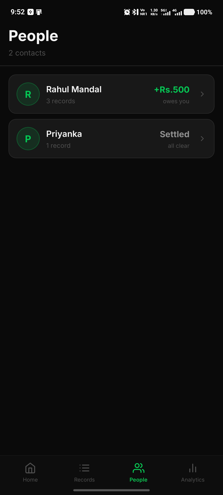
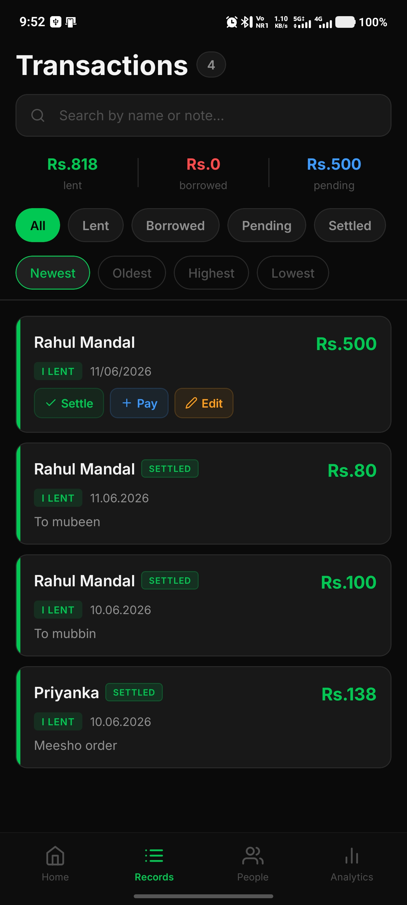
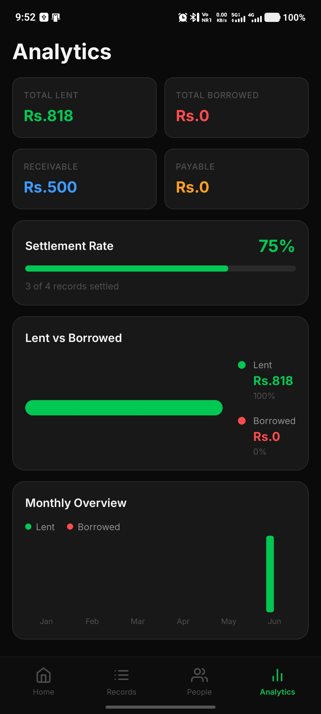
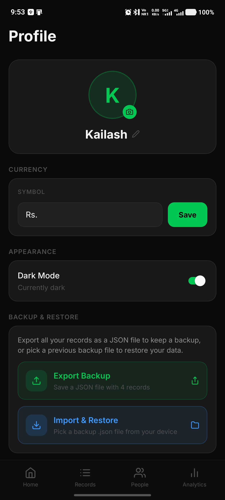
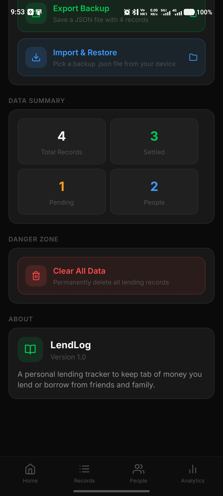

# LendLog — Personal Lending Tracker

<p align="center">
  
  
  
  
</p>

<p align="center">
  <b>A personal lending tracker to keep tab of money you lend or borrow from friends and family.</b>
</p>

<p align="center">
  <a href="https://mega.nz/file/xZ1yQC7b#q6XtFD8B8nQBWjAHG-umwK_8brMxBzHPIprChUAXzA4">
    
  </a>
</p>

---

## About LendLog

LendLog is a clean, dark-themed mobile app built with **React Native (Expo)** that helps you track every rupee you lend or borrow. No more forgotten debts or awkward "did I pay you back?" conversations. LendLog keeps everything organized — per person, per record, with full payment history and smart analytics.

---

## Screenshots

| Records | People | Analytics | Profile |
|---------|--------|-----------|---------|
|  |  |  |  |

<p align="center">
  
</p>

---

## Download

> **[⬇️ Download LendLog APK (v1.0)](https://mega.nz/file/xZ1yQC7b#q6XtFD8B8nQBWjAHG-umwK_8brMxBzHPIprChUAXzA4)**

Install the APK directly on any Android device. No Play Store required.

---

## Features

### 🏠 Home Dashboard
- Displays a **live summary** of total amount lent, total borrowed, and pending balance at a glance.
- Shows **recent transactions** (last 5 records) right on the home screen.
- **Net balance indicator** — instantly see if you're owed money or you owe money, with color-coded status (green = people owe you, red = you owe).
- Smart **amount formatting** — large amounts are displayed as K (thousands) or L (lakhs) for easy reading.
- **Pull-to-refresh** to reload all data.
- **Floating Action Button (FAB)** with a quick-add menu — tap to instantly add a new "I Lent" or "I Borrowed" record.
- Haptic feedback on interactions for a native feel.

---

### 📋 Records (Transactions)
- Full list of **all lending and borrowing records** in one place.
- **Search bar** — search records by person name or note in real time.
- **Filter tabs**: All / Lent / Borrowed / Pending / Settled — quickly narrow down what you're looking at.
- **Sort options**: Newest / Oldest / Highest / Lowest amount — find records your way.
- Each **Record Card** shows:
  - Person name
  - Amount (color-coded: green for lent, red for borrowed)
  - Date of the transaction
  - Optional note/description
  - Settlement status badge (Settled / Pending)
  - "I LENT" or "I BORROWED" label
- **Action buttons on pending records**:
  - ✅ **Settle** — mark the full record as settled instantly.
  - ➕ **Pay** — record a partial payment against the record.
  - ✏️ **Edit** — update record details (amount, note, date, due date).
- Settled records are clearly marked and greyed out so you always know what's cleared.

---

### 👥 People
- Groups all records by **contact/person name** automatically.
- Shows each person's:
  - **Net balance** — how much they owe you (green) or you owe them (red).
  - **"Settled"** label if all records with that person are cleared.
  - Number of records linked to that person.
- Tap on any person to open their **Person Detail** view:
  - See all records for that person in one place.
  - View full payment history per record.
  - **Settle All** — settle every outstanding record with that person in one tap.
  - **Rename** the person across all records at once.
  - **Delete All** records for that person.

---

### 📊 Analytics
- Clean analytics dashboard with **4 stat cards**:
  - **Total Lent** (green) — sum of all money you've lent out.
  - **Total Borrowed** (red) — sum of all money you've borrowed.
  - **Receivable** (blue) — pending amount people owe you.
  - **Payable** (orange) — pending amount you owe others.
- **Settlement Rate** — a percentage progress bar showing what fraction of all records have been settled (e.g., "3 of 4 records settled — 75%").
- **Lent vs Borrowed** — horizontal bar chart comparing total lent vs total borrowed with exact amounts and percentages.
- **Monthly Overview** — a bar chart breaking down your lending and borrowing activity month by month across the year (Jan–Dec). Both Lent and Borrowed bars are shown side-by-side per month.

---

### 👤 Profile & Settings
- **Profile name** — set your display name, shown across the app. Editable at any time with a pencil icon.
- **Profile photo** — tap the camera icon on the avatar to set a custom profile picture from your device gallery.
- **Currency symbol** — customize the currency symbol displayed throughout the app (default: Rs.). Type any symbol and hit Save.
- **Dark Mode toggle** — switch between Dark and Light themes. The entire app theme updates instantly. Currently supports dark mode (default) and light mode.
- **Backup & Restore**:
  - **Export Backup** — exports all your records as a `.json` file saved to your device. Useful for manual backups before clearing data or switching phones.
  - **Import & Restore** — pick a previously exported `.json` backup file from your device to fully restore all your records and settings.
- **Data Summary** — a quick stats panel showing:
  - Total Records
  - Settled count
  - Pending count
  - Total unique People
- **Danger Zone**:
  - **Clear All Data** — permanently deletes all lending records from the app. A confirmation prompt is shown before deletion.
- **About** section — displays the app name (LendLog), version (1.0), and a short description.

---

### 💳 Partial Payments
- Every pending record supports **partial payment tracking**.
- Tap the **"+ Pay"** button on any record to log a partial payment with:
  - Amount paid
  - Date of payment
  - Optional note
- The remaining balance updates automatically.
- Full payment history is stored per record — you can see every installment paid.
- Individual payments can be **deleted** if added by mistake.
- Once the full amount is covered, the record can be marked as settled.

---

### 📅 Due Dates
- Each record optionally supports a **due date** — the date by which you expect the money back (or plan to repay).
- Set when creating or editing a record.
- Visible on the record detail view.

---

### 🔍 Search
- Global search on the Records screen — searches across **person names and notes** simultaneously.
- Instant results as you type.

---

### 🎨 Theming
- Full **Dark Mode** and **Light Mode** support.
- App-wide theme controlled from the Profile screen.
- Colors adapt across all screens, cards, modals, and charts.
- Built with a centralized color system (`constants/colors.ts` + `hooks/useColors.ts`).

---

### 💾 Local Storage
- All data is stored **100% locally** on the device using `AsyncStorage`.
- No internet connection required. No account needed. No cloud sync.
- Your data stays private on your phone.

---

## Tech Stack

| Layer | Technology |
|-------|-----------|
| Framework | React Native (Expo SDK) |
| Navigation | Expo Router (file-based routing) |
| Storage | AsyncStorage (local, offline) |
| Icons | @expo/vector-icons (Feather) |
| Charts | Custom BarChart & PieChart components |
| Animations | FadeInView (React Native Animated) |
| Haptics | expo-haptics |
| Fonts | Inter (via expo-google-fonts) |
| Language | TypeScript |
| Build | EAS Build (Expo Application Services) |

---

## Project Structure

```
artifacts/lendlog/
├── app/
│   ├── _layout.tsx              # Root layout with providers
│   ├── +not-found.tsx           # 404 screen
│   └── (tabs)/
│       ├── _layout.tsx          # Tab bar layout
│       ├── index.tsx            # Home Dashboard
│       ├── records.tsx          # Transactions / Records list
│       ├── people.tsx           # People grouped view
│       ├── analytics.tsx        # Analytics & charts
│       ├── profile.tsx          # Profile & settings
│       └── settings.tsx         # Settings helpers
├── components/
│   ├── AddRecordModal.tsx       # Add/Edit record modal
│   ├── RecordCard.tsx           # Single record card UI
│   ├── PersonCard.tsx           # Person summary card
│   ├── PersonModal.tsx          # Person detail modal
│   ├── StatCard.tsx             # Analytics stat card
│   ├── BarChart.tsx             # Monthly bar chart
│   ├── PieChart.tsx             # Lent vs Borrowed chart
│   ├── CustomTabBar.tsx         # Bottom tab bar
│   ├── FadeInView.tsx           # Fade-in animation wrapper
│   ├── KeyboardAwareScrollViewCompat.tsx
│   ├── ErrorBoundary.tsx
│   └── ErrorFallback.tsx
├── context/
│   ├── StorageContext.tsx       # Global data/state management
│   └── ThemeContext.tsx         # Theme (dark/light) management
├── constants/
│   └── colors.ts                # Color palette definitions
├── hooks/
│   └── useColors.ts             # Theme-aware color hook
├── types/
│   └── index.ts                 # TypeScript interfaces
├── assets/images/
│   └── icon.png                 # App icon
├── app.json                     # Expo app config
├── eas.json                     # EAS build config
├── package.json
└── tsconfig.json
```

---

## Getting Started (Run from Source)

### Prerequisites
- Node.js 18+
- pnpm or npm
- Expo CLI
- Android Studio (for Android emulator) or a physical Android device

### Installation

```bash
# Clone the repository
git clone https://github.com/your-username/lendlog.git
cd lendlog/artifacts/lendlog

# Install dependencies
npm install

# Start the development server
npx expo start
```

Scan the QR code with the **Expo Go** app on your phone, or press `a` to open on an Android emulator.

### Build APK

```bash
# Install EAS CLI
npm install -g eas-cli

# Login to Expo
eas login

# Build APK
eas build -p android --profile preview
```

---

## License

This project is for personal use. Feel free to fork and customize it for your own needs.

---

## About the App

**LendLog v1.0** — A personal lending tracker to keep tab of money you lend or borrow from friends and family.

Built with ❤️ using React Native & Expo.
